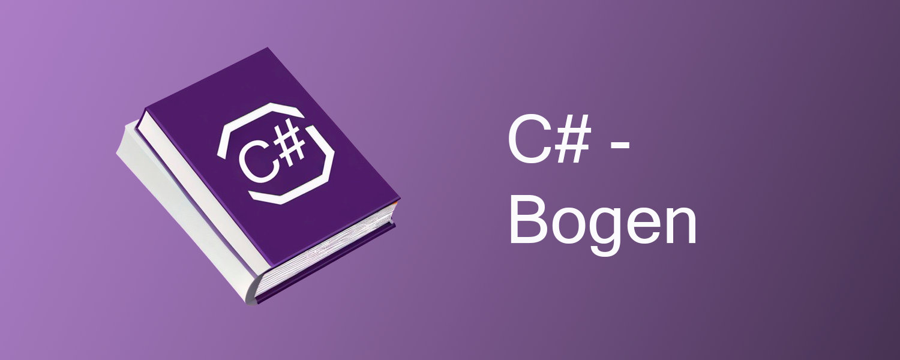
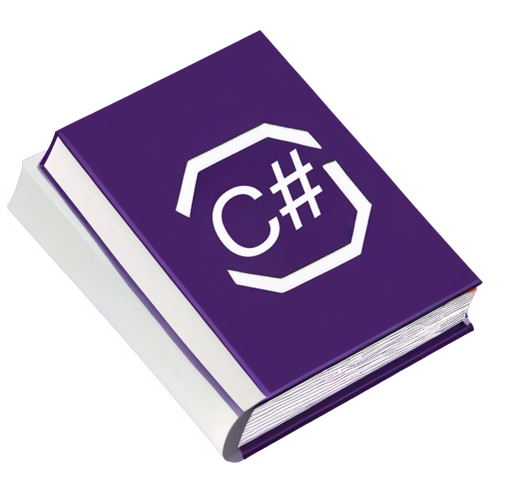
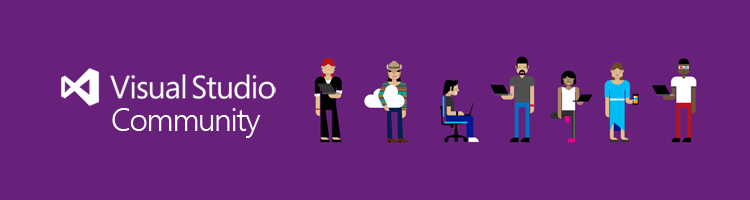

<table>
  <tr> 
    <td>
    
    </td>
    <td>
    
 Start med at lære C# og grundlæggende programmerings termer. 

    
 Bogen her indeholder både teori, eksempler, videoer og opgaver til at lære omkring 
     <strong>C#</strong>!

    

    

    </td>
  </tr>
</table>

<table>
        <tr>
          <th width='650'>Ekstra materiale</th>
          <th>Links</th>
        </tr>
        <tr>
          <td align="center">
                
 Powerpoint-slides 
 
                
 Her er slides som bliver gennemgået på klassen opdelt efter mapperne her på GitHub! 
 
          </td>
          <td align="center"> </td>
        </tr>
        <tr>
          <td align="center">
                  
Notion dokumentation og guide

                  
På Notion er der ekstra dokumentation og matrialle. Vi har generelt alt information på Notion, så man kan også finde meget andet end C# dokumentation! 

          </td>
          <td align="center"> </td>
        </tr>
        <tr>
          <td align="center" style="color: red;" >
                
Video guide [TBA] 

                
Vi prøver at video dokumentere vores pensum, det er en løbende process, men det burde gøre det nemmere, hvis man er mere til video formattet end selv at læse! 

          </td>
          <td align="center"> </td>
        </tr>
</table>

## [Visual Studio](./VisualStudio)

Vi bruger Visual Studio på de fleste af vores hovedforløb, det er den oplagte IDE til C# og .NET udvikling!

 

I kommer til at få en gennemgang med opsætning og en kort gennemgang af selve programmet (De er begge også på [Youtube](https://www.youtube.com/playlist?list=PL7-jfBWeCNfwlbjdpc_R3EIJYmZ-Q-qAu)). I har arbejdet i en IDE før, såsom VSCode, så det burde ikke være helt nyt for jer!

## [C#-Basics](./CSharpBasics)

C#-Basics dækker over de mest generelle ting for **C#**! Det er emner som er universelle mellem programmeringssprog og som kan bruges i stort set alle former for C# applikationer, fra konsol-apps og API-lag til WPF og Blazor!

Vi bruger hovedsagligt konsol-applikationer under C#-Basics, men man skal være velkommen til at bygge mere på det såsom WPF eller Blazor!

## [.NET eller dotnet](./dotnet)

.NET også kaldet dotnet er her alle vores mere komplekse applikationer hører til! Det kan for eksempel være [Blazor](./dotnet/Blazor) eller [WPF](./dotnet/WPF)
